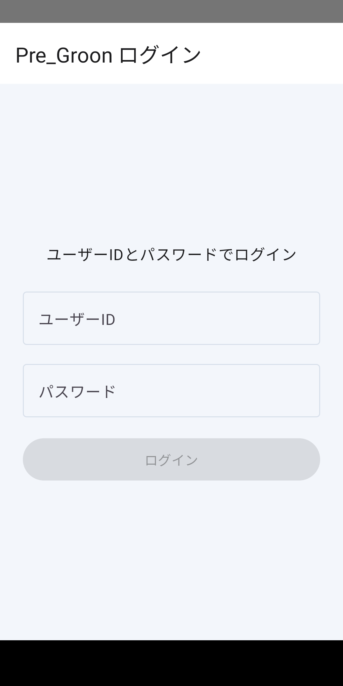
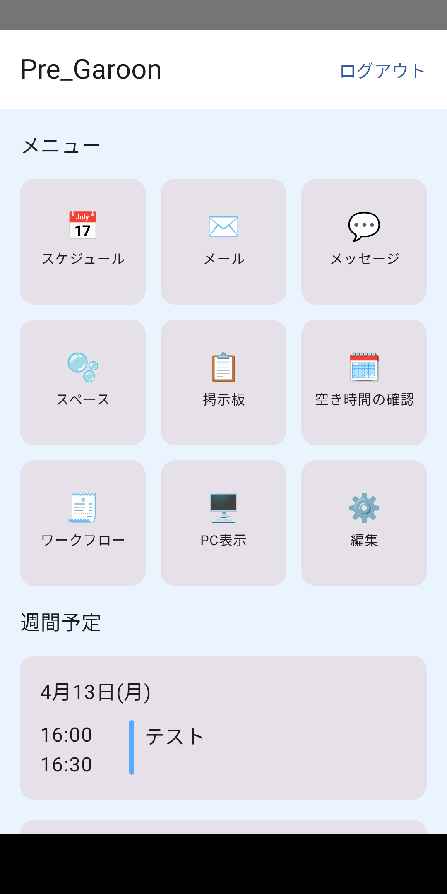
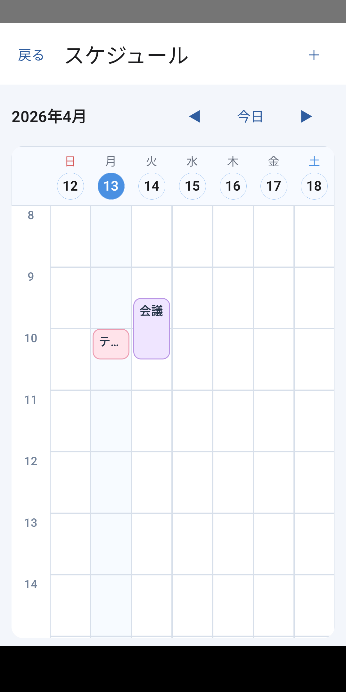
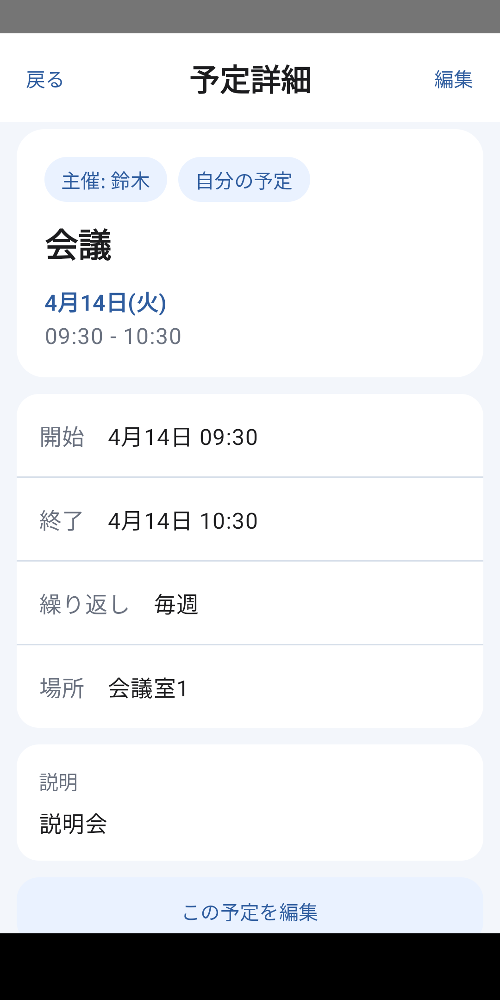
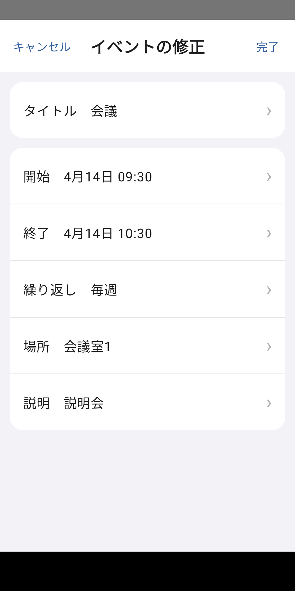
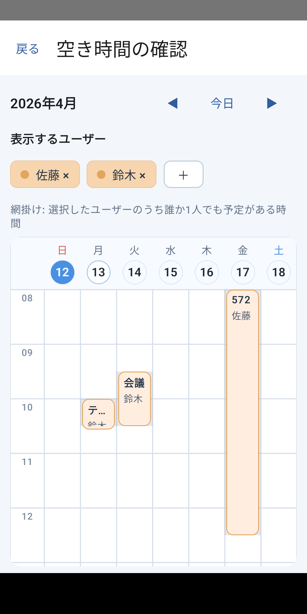
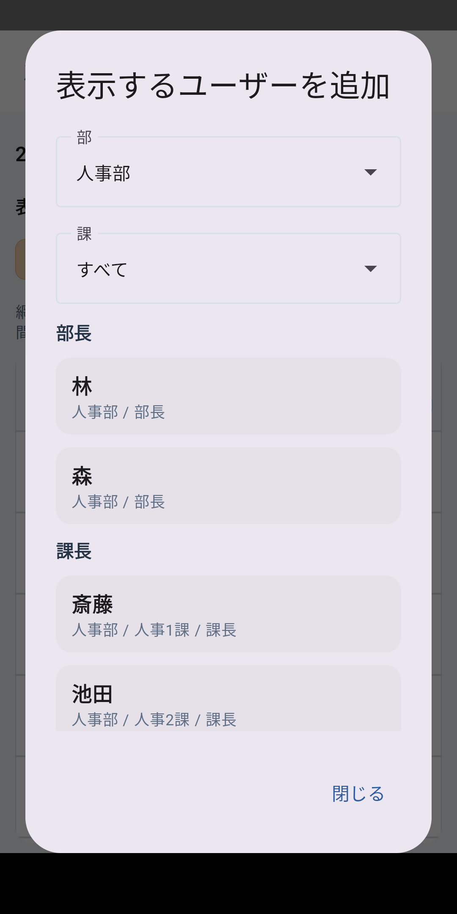
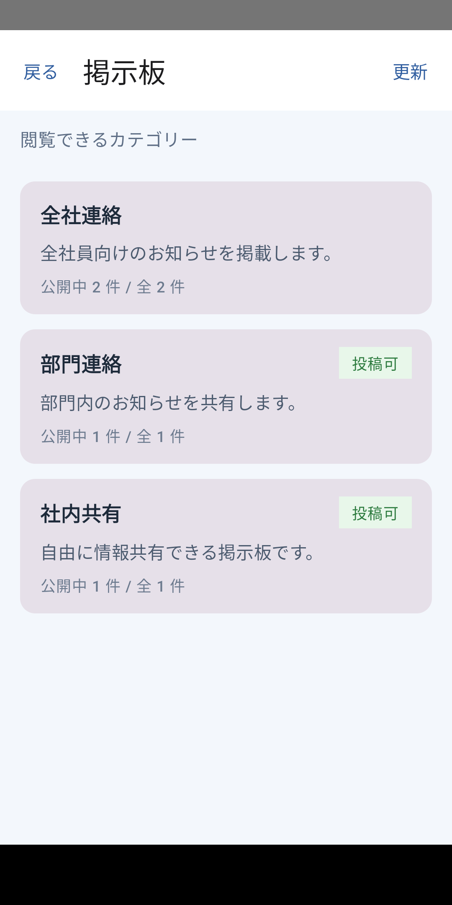
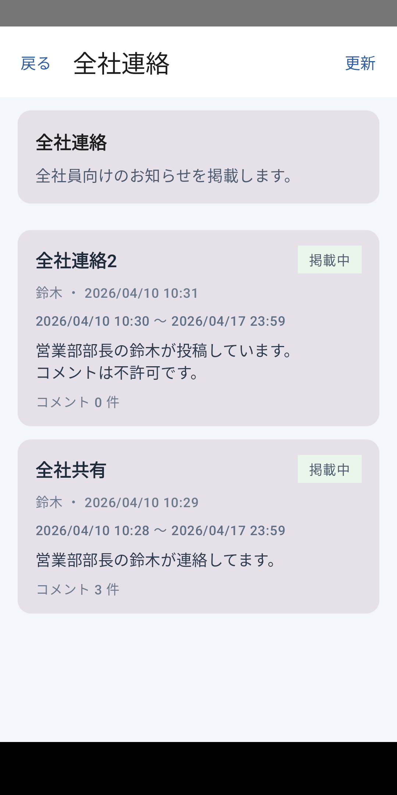
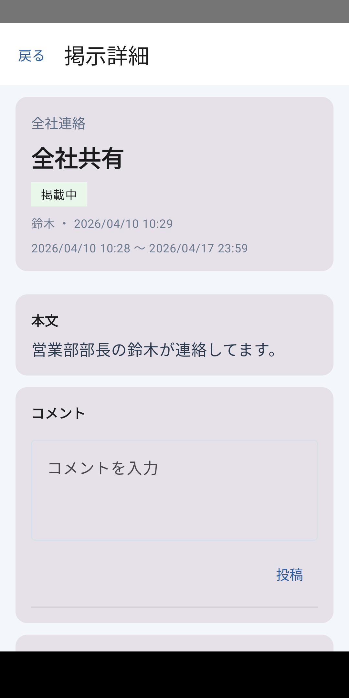

# Garoon_pre

業務系グループウェアを想定した Android アプリのポートフォリオです。  
スケジュール管理、空き時間確認、掲示板機能を題材に、**モダン Android 開発での設計・実装・改善**を意識して作成しました。

単に画面を作るだけでなく、以下を重視しています。

- Jetpack Compose を用いた UI 実装
- マルチモジュール構成による責務分離
- DataStore と Room の役割分離
- WorkManager による同期
- Unit Test / DAO Test / UI Test / Worker Test の導入
- GitHub Actions による build / test 自動化

---

## このリポジトリで見てほしい点

- **UI 実装だけでなく、継続開発しやすい構成を意識していること**
- **ローカルデータの責務を DataStore と Room に分けていること**
- **ViewModel / DAO / UI / Worker でテスト対象を分けていること**
- **GitHub Actions で build / test を自動化していること**

詳細な設計判断は以下にまとめています。

- [Architecture](docs/architecture.md)
- [Decisions](docs/decisions.md)
- [Testing](docs/testing.md)
- [Integration](docs/integration.md)
---

## アプリ概要

本アプリは、業務利用を想定したグループウェア系 Android アプリの試作です。  
主に Android アプリ側の設計・実装・改善を題材にしており、サーバーサイドは動作確認に必要な最小限の実装にとどめています。

- ログイン
- スケジュール一覧 / 詳細 / 作成 / 編集
- 空き時間確認
- 掲示板一覧 / 詳細 / 投稿 / コメント

---

## 主な機能

### スケジュール
- 予定一覧の表示
- 予定詳細の表示
- 予定作成 / 編集
- 繰り返し予定への対応

### 空き時間確認
- 複数ユーザーの予定比較
- 選択状態の保持
- 週単位での確認

### 掲示板
- 掲示板一覧表示
- 投稿一覧表示
- 投稿詳細表示
- 投稿作成 / 編集
- コメント投稿

### その他
- ログイン状態の保持
- 定期同期
- Compose ベースの UI

---

## 動作モード

本アプリは、ログイン画面から利用モードを切り替えて起動できます。

### サーバーモード
ローカル API サーバーへ接続して動作するモードです。  
API を含めた実際の通信確認をしたい場合に利用します。

接続先は次の2種類です。

- エミュレーター: `http://10.0.2.2:3000/`
- USB 実機: `http://localhost:3000/`

### ローカルモード
アプリ内部のローカルデータのみで動作するモードです。  
サーバーを起動せずに、ログイン、スケジュール、掲示板の確認ができます。

ローカルモードでは、アプリ内部に保存される `local_mock_state.json` を使用します。  
このファイルが存在しない場合は、seed データから初期状態を再生成します。  
また、保存済みデータは `reset()` によって初期状態へ戻すことができます。

---

## アプリの使い方

### 1. アプリ起動
アプリを起動するとログイン画面が表示されます。

### 2. モード選択
ログイン画面で次のいずれかを選択します。

- サーバーを使う
- ローカルのみ

サーバーを使う場合は、続けて接続先を選択します。

- エミュレーター
- USB実機

### 3. ログイン
ユーザーIDとパスワードを入力してログインします。

ローカルモードでは、seed に含まれる固定ユーザー(1 ~ 33)でログインできます。  
例:

- `1 / 1`
- `2 / 2`
- `3 / 3`

---

## ローカルデータについて

ローカルモードでは、次のようなデータをアプリ内部に保存します。

- users
- schedules
- boardCategories
- boardPosts

boardPosts にはコメント情報も含まれます。

### ローカルデータの初期化方法

#### 方法1: アプリデータ削除
端末またはエミュレーターの設定画面から、対象アプリのデータを削除してください。  
次回起動時に seed データから再生成されます。

#### 方法2: adb で削除
複数デバイスが接続されている場合は `-s` を付けて対象を指定してください。

## 技術スタック

### Android / UI
- Kotlin
- Jetpack Compose
- Navigation Compose
- Material 3
- Single Activity

### アーキテクチャ / 状態管理
- MVVM
- Multi Module
- Hilt
- Kotlin Coroutines / Flow

### データ層
- Retrofit
- OkHttp
- Moshi
- Room
- DataStore
- WorkManager

### テスト
- JUnit4
- kotlinx-coroutines-test
- MockK
- Compose UI Test
- Room DAO Test
- Worker Test

### CI
- GitHub Actions

---

## モジュール構成

- `app`
- `core`
  - `core:common`
  - `core:designsystem`
  - `core:model`
  - `core:network`
  - `core:session`
- `feature`
  - `feature:auth`
  - `feature:availability`
  - `feature:board`
  - `feature:home`
  - `feature:schedule`
  - `feature:user`
- `sync`

## 設計方針

本プロジェクトでは、ローカルデータの責務を次のように分けています。

- **DataStore**  
  セッション情報、ログイン状態、画面の軽量な選択状態などの保存
- **Room**  
  スケジュールのような業務データの保存と参照

この方針により、設定値と業務データを分離し、ローカルキャッシュの役割を明確化しました。

---

## スクリーンショット

以下は主要画面の例です。  
`screenshots/` ディレクトリに画像を配置して参照してください。

## ログイン

## ホーム

## スケジュール一覧

## スケジュール詳細

## 空き時間確認

## 掲示板

---

## 開発環境

- Android Studio
- JDK 17
- compileSdk 35
- minSdk 26
- targetSdk 35